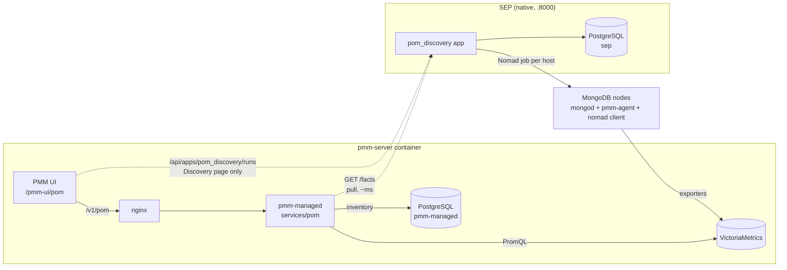
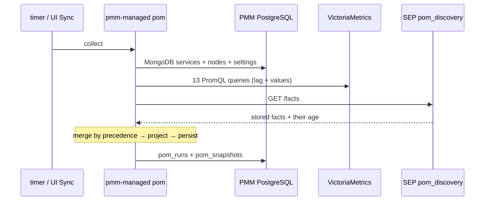
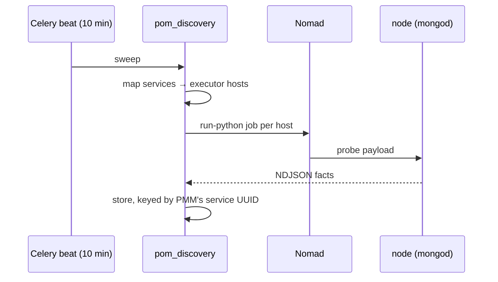

# POM — How It Works Today

**As of:** 2026-08-12
**Derived from:** `pmm/` @ `psmdb-openmanager` (`api/pom/v1/`, `managed/services/pom/`,
`managed/models/pom_*`, migration 119, `ui/apps/pmm/src/pom/`,
`ui/packages/plugins/pom/`), `SEP/` @ `psmdb-openmanager`
(`app/sep/apps/pom_discovery/`). Verified against a running stack.

> **This will change.** It is deliberately short, and describes the shape rather than
> the reasoning. For the system this sits inside, see [`topology.md`](topology.md).

---

## What POM is

**POM (PSMDB Open Manager)** answers *"what MongoDB do I have, and what state is it in?"*
as one document: environments → clusters → services, each service carrying its identity,
replica-set role, reachability, load, and what is installed on its host.

It exists because PMM has no topology object. `cluster` and `replication_set` are flat
string columns on a service, so reconstructing replica sets and sharded clusters is a gap
in PMM rather than a feature belonging elsewhere.

## The split



**pmm-managed owns derivation.** Identity, versions, topology, reachability and load all
come from two sources PMM already has: its own inventory in PostgreSQL, and the exporter
metrics in VictoriaMetrics. Reading them from anywhere else meant reading a lossy copy.

**SEP owns work on the host.** Anything needing a process on a database node: the facts
no metric carries today, and the actions — upgrade, restart, config change — tomorrow.

**They meet at one HTTP contract.** pmm-managed pulls the facts a sweep produced; the
Discovery page calls the same app directly for the sweep history, because that history is
SEP's and nothing proxies it.

## The collection



Every source emits flat **facts** keyed by `(service, field)`. The merge picks a winner
per field from a **declared precedence table**, never from call order, and keeps each
field's source and observation time. That is what lets a third source be added without
any source knowing about the others.

Runs at ~130 ms, on a 30 s cache, and also on a timer so the history exists when nobody
is looking.

## The probe sweep

Separate clock, separate speed:



**`GET /facts` never probes.** It answers from the last completed sweep and says how old
that is. A sweep takes tens of seconds; the consumer's collection takes ~130 ms, and must
not inherit the difference.

Consequence: clicking **Sync** in the UI does *not* dispatch Nomad jobs. On-host facts
refresh on the sweep's own schedule.

## Where the data lives

| Store | Owner | Holds |
| --- | --- | --- |
| `pmm-managed` DB — `pom_runs` | pmm-managed | one row per collection: counts, per-source verdict, errors |
| `pmm-managed` DB — `pom_snapshots` | pmm-managed | the topology document as JSONB, one per run, `ON DELETE CASCADE` |
| `sep` DB — `pom_discovery_run` | SEP | one row per sweep: its facts, and a record per mapped service (host, resolution, answered, host duration), both JSONB |
| VictoriaMetrics | PMM | the exporter series POM reads; **POM writes nothing** |

Both tables are pruned on write (100 runs / 50 sweeps), so neither grows unbounded. The
documents are JSONB rather than a relational tree because the model is still moving;
`schema_version` is what a reader checks.

Facts in `pom_discovery_run` are keyed by **PMM's service UUID**, not SEP's inventory id —
the only key the consumer can join on.

## The API surface

| Path | Served by | For |
| --- | --- | --- |
| `GET /v1/pom/topology` | pmm-managed | the document |
| `GET /v1/pom/discovery/runs[/{id}]` | pmm-managed | collection history |
| `POST /v1/pom/discovery/runs` | pmm-managed | recollect now (409 if one is in flight) |
| `GET /api/apps/pom_discovery/facts` | SEP | the last sweep's facts — pulled by pmm-managed |
| `GET/POST /api/apps/pom_discovery/runs` | SEP | sweep history / queue one (202; 409 if one is in flight) — called by the browser |
| `GET /api/apps/pom_discovery/runs/{id}` | SEP | one sweep with its per-service records and its facts; the list carries neither |

`/v1/pom` is authorised by the Grafana session (`viewer`), via two entries in
`grafana/auth_server.go` — `/v1/pom` for REST and `/pom.` for native gRPC.

PMM is configured with **where SEP is** (`PMM_SEP_URL`), not where the app is; each
consumer appends its own `/api/apps/<module>` path.

## The UI

A PMM page at **`/pmm-ui/pom`** — *not* under `/sep`; the old path redirects. Three
routes, each answering a different question:

| Route | Reads | Shows |
| --- | --- | --- |
| `/pom` | `GET /v1/pom/topology` | a table per environment, a row per cluster, unfolding to its services |
| `/pom/topology` | the same document | one row per service, every field the snapshot stores |
| `/pom/runs` | `GET/POST /api/apps/pom_discovery/runs`, `GET .../runs/{id}` on unfold | SEP's sweeps, a button that queues one, and per sweep a row per service: where it was probed, whether it answered, how long its host took, and every fact it returned |

The first two are wrapped in `PomPage`, *not* `SepPage`: that wrapper holds children
behind a SEP token exchange and fails closed, which would blank pages whose every byte
comes from pmm-managed. `PomPage` keeps the PMM-admin check and drops the gate. They
talk to `/v1/pom` with a plain same-origin `fetch`.

**Discovery is the exception**, and the only place the browser talks to SEP. The sweeps
are SEP's — pmm-managed pulls their facts but does not proxy their history — so the page
asks the app itself, through `@sep/api` with a minted bearer. It is therefore mounted on
its own route inside `SepPage`, so the gate covers that page and nothing else: SEP being
down costs Discovery and leaves the rest of POM working. `PomApp` deliberately does not
declare `runs`; a static segment outranks its splat, and two mounts would leave an
ungated copy on the same path.

## Reaching it

```
./om pom          the document + a row per service   ./om pom sql | api
./om discovery    the last sweep and its facts       ./om discovery sql | api
./om sep-api      any SEP app
```

## Deliberately not there

- **No VM write-back.** POM reads VictoriaMetrics and writes nothing to it.
- **No async runs on the PMM side.** Unnecessary once the slow half is pulled.
- **No `pom` database.** Each side keeps its data in its own; the contract is HTTP.
- **`pom_worker` / `pom_api` are gone** — the previous, SEP-only implementation, retired
  2026-08-12 once parity held.
