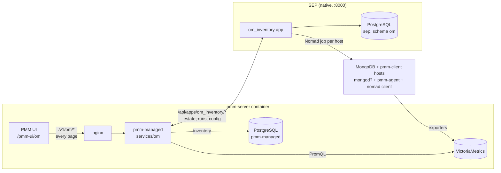
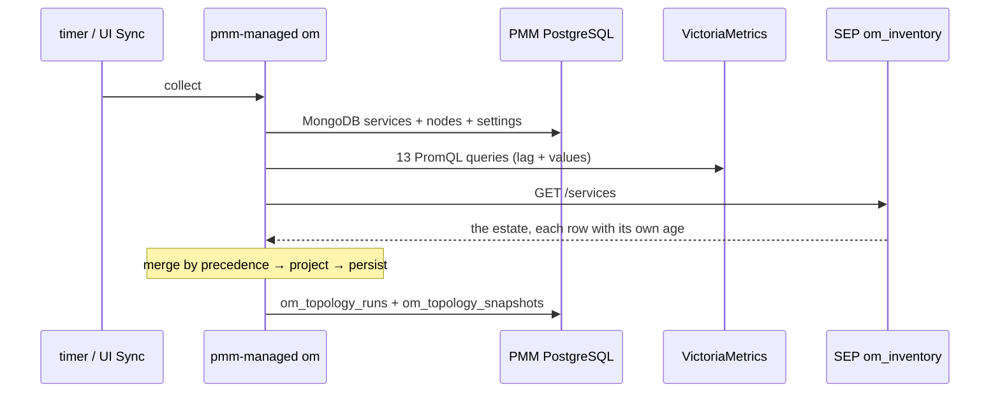
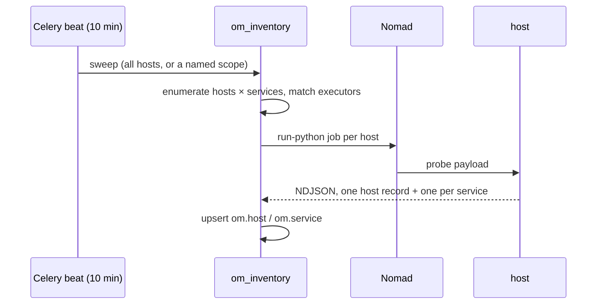
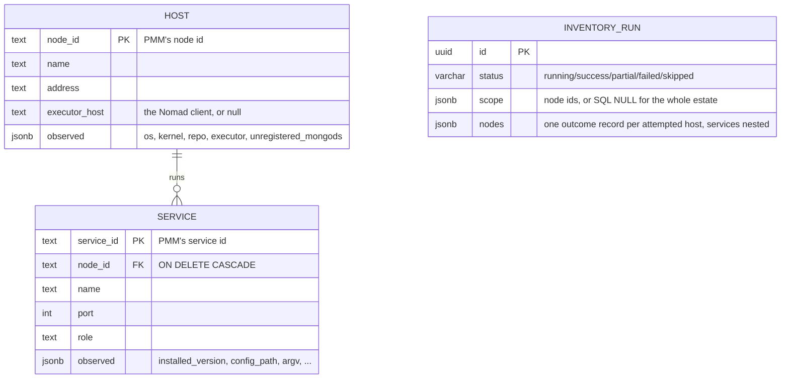

# OM - How It Works Today

**As of:** 2026-08-19
**Derived from:** `pmm/` @ `PMM-15326-pom-inventory` (`api/om/v1/`,
`managed/services/om/`, `managed/services/grafana/auth_server.go`,
`ui/packages/plugins/om/`), `SEP/` @ `PMM-15326-pom-inventory`
(`app/sep/apps/om_inventory/`, `app/sep/om/`). Verified against a running stack.

> **This will change.** It describes the shape rather than the reasoning. For the system
> this sits inside, see [`topology.md`](topology.md).

---

## What OM is

**OM (OpenManager)** answers two questions that PMM alone cannot:

1. *"What MongoDB do I have, and what state is it in?"* - as one document:
   environments → clusters → services. PMM has no topology object; `cluster` and
   `replication_set` are flat string columns on a service, so reconstructing replica
   sets and sharded clusters is a gap in PMM rather than a feature belonging elsewhere.
2. *"What is actually on these machines, and can I act on them?"* - the installed
   package version, the config file, the command line, whether the host can reach
   Percona's repository, and **which hosts have no database at all**. None of that is
   in a metric, so it needs a process on the host.

The second question is why OM keeps its own inventory rather than only deriving one.

## The split



**pmm-managed owns derivation.** Identity, versions, topology, reachability and load
come from two sources PMM already has: its own inventory in PostgreSQL, and the
exporter metrics in VictoriaMetrics.

**SEP owns work on the host.** Anything needing a process on a node: what no metric
carries today, and the actions - upgrade, restart, config change - tomorrow.

**The browser only ever talks to pmm-managed.** Every OM page reads PMM's own origin;
pmm-managed proxies SEP's estate at `/v1/om/inventory/*`. That is a deliberate
reversal of the earlier shape, where the Inventory page held a SEP bearer minted from
the PMM session: the gate that supplied it fails closed, so a SEP that was down or
unconfigured blanked the page rather than letting it render its own error.

## Two things called a "run"

The single most common confusion, and the reason they sit at different paths:

| | pmm-managed's **collection** | SEP's **refresh** |
| --- | --- | --- |
| Path | `POST /v1/om/topology/runs` | `POST /v1/om/inventory/runs` |
| Does | recomputes the topology document | dispatches a Nomad job per host |
| Touches a database host | never | always |
| Takes | ~130 ms | tens of seconds |
| In the UI | the **Sync** button, on Overview and Services | **Refresh estate**, on Inventory |

## The collection



Every source emits flat **facts** keyed by `(service, field)`. The merge picks a winner
per field from a **declared precedence table**, never from call order, and keeps each
field's source and observation time.

**It reads the estate, not the last sweep.** The probe source used to pull `GET /facts`,
which served whatever the most recent completed sweep collected - so a service that
sweep failed to reach contributed nothing, and PMM lost every probe field for it until
some later sweep succeeded. A host that went unreachable looked like a host with
nothing installed on it. The estate is upserted, so the same service still answers with
what it last reported and how old that is.

## The refresh

Separate clock, separate speed:



**Hosts are enumerated, not derived from services.** A host with no database has no
service to be discovered through, and that host is the point: it is where a database
can be installed.

**The payload runs on whatever Python the host has.** The Tasks layer minifies it
before dispatch, and the minifier rewrites an f-string's inner quotes into PEP 701
syntax that only Python 3.12 and later can parse - so an f-string containing a method
call on a literal is a syntax error on an older host and fine on a newer one. This
workspace's own `pmm-server` runs 3.9 and failed every probe for that reason while the
database containers, on 3.12, were unaffected. Values are bound to names before any
f-string, and a test minifies the payload and rejects the construct.

**A refresh can be scoped.** `{"node_ids": [...]}` refreshes named hosts; absent or
empty means the whole estate. Conflict is judged **per host**, so a one-host refresh is
not refused merely because the ten-minute schedule happens to be running.

**Single-flight is enforced in the sweep, not only at the endpoint**, because the
schedule does not go through the endpoint - Celery beat calls the task directly. With
the check in the handler alone a scheduled sweep starts on top of one already
dispatching, both enqueue the same job for the same host, and the Tasks layer refuses
the duplicate with `409 Identical queue item already running` - recorded against a host
that is perfectly healthy, moving its failure timestamps for a race rather than a
fault. A refused sweep records a run with status `skipped` naming what held it, rather
than returning silently: a ten-minute schedule that quietly does nothing leaves a gap
in the history that reads exactly like it having fired and found nothing.

## The data model

SEP's half lives in a dedicated **`om` schema** inside the existing `sep` database -
not a separate database, and not table prefixes. In the code the schema is a *symbolic*
token translated per bind, because SQLite has no schemas and the test lane routes every
table into a per-worker schema.



Both entity tables carry the same **freshness block**, and it is what makes an upserted
estate readable:

| Column | Means |
| --- | --- |
| `first_seen_at` | when OM first wrote a row for it |
| `last_attempt_at` | when a run last *tried* it |
| `last_success_at` | when it last *answered*; null means it never has |
| `failing_since` | the **first** failure after the last success - what makes "failing for three days" expressible rather than only "failed a minute ago" |
| `consecutive_failures` | how badly |
| `last_error` | the most recent detail |
| `last_run_id` | which run last touched it |

**Only a run that attempted an entity moves its timestamps.** A host with no executor
is *seen* every sweep and *probed* by none, so its identity stays current while its
failure history stays where it was.

**`observed` is JSONB on purpose.** Collecting a new attribute is a payload change
rather than a schema change; `repo.*` was added that way and reached the UI with no
migration, no proto change and no code in pmm-managed knowing it existed. The cost is
that reading one back needs a shape check rather than a type.

### The run row

| Column group | Holds |
| --- | --- |
| `services_total / resolved / orphaned / answered` | what enumeration found, and what could be reached. `resolved=9, answered=0` is a healthy mapping with broken executors - a distinction one "failed" count hides |
| `hosts_total / probeable / answered` | the same one level up. The gap between the first two is the estate nothing can be dispatched to, which is an onboarding fact rather than a failed run |
| `scope` | node ids, or SQL **NULL** for a full sweep. Without it a one-host refresh reads as a full sweep that found one host |
| `nodes` | one outcome record per attempted entity: where it ran, how the host was matched, whether it answered, how long, and the error |

`nodes` is **host-oriented**: one entry per host attempted, each carrying the services
on it. A flat service list - which it was - cannot show a machine with a PMM client and
no database, however many times it is probed, and that machine is the case OM most
exists to describe. One dispatch covers every service on a host, so the host owns the
timing and the failure and its services carry only what is theirs; previously the
duration was copied onto each service and read as several measurements when it was one.

It carries **outcomes, never observations**. What the probe found belongs to the
estate, where it is upserted and stays current; a receipt carrying the attributes too
would be a second copy that goes stale on the next refresh.

### PMM's half

| Store | Holds |
| --- | --- |
| `pmm-managed` DB - `om_topology_runs` | one row per collection: counts, per-source verdict, errors |
| `pmm-managed` DB - `om_topology_snapshots` | the topology document as JSONB, one per run, `ON DELETE CASCADE` |
| VictoriaMetrics | the exporter series OM reads; **OM writes nothing** |

Both are pruned on write (100 runs / 50 sweeps).

### Identity

Every OM row is keyed on **PMM's own id** - `node_id` for hosts, `service_id` for
services. That is what makes the UI's join a map lookup with no matching rule, and what
lets PMM's trigger pass node ids through untranslated.

The trade is real and visible: `pmm-agent setup --force` re-registers a node under a
**new** id, so OM gains a row and keeps the old one. Nothing prunes it, which is why
the Hosts page has a delete action.

## The API surface

### SEP's app - `/api/apps/om_inventory`

Authorised at the mount: `IsApiAuthenticated`, plus a bearer required on unsafe
methods. Reached by pmm-managed with the `--sep-token` bearer, never by a browser.

| Method | Path | For |
| --- | --- | --- |
| `GET` | `/hosts` | every host with its services. Filters: `has_service`, `failing`, `executor` |
| `GET` | `/hosts/{node_id}` | one host, services nested |
| `GET` | `/services` | flat service list - **the contract pmm-managed's collection reads** |
| `GET` | `/services/{service_id}` | one service |
| `DELETE` | `/hosts/{node_id}` | forget a host and its services |
| `DELETE` | `/services/{service_id}` | forget one service |
| `POST` | `/runs` | refresh; `{"node_ids": [...]}` or `{}`. 409 names the run holding a host |
| `GET` | `/runs[/{run_id}]` | refresh history; the detail carries `nodes`, the list does not |
| `GET` | `/config` | every setting, its value, and whether an override is in effect |
| `PATCH` | `/config` | change settings; atomic, per-key 422 |
| `DELETE` | `/config/{key}` | revert one to the deployed value |

### PMM's proxy - `/v1/om`

| Method | Path | For |
| --- | --- | --- |
| `GET` | `/topology` | the derived document |
| `GET`/`POST` | `/topology/runs[/{id}]` | pmm-managed's own collection |
| `GET` | `/inventory/hosts[/{node_id}]` | the estate, proxied |
| `GET` | `/inventory/services[/{service_id}]` | " |
| `DELETE` | `/inventory/hosts/{node_id}`, `/inventory/services/{id}` | " |
| `POST` | `/inventory/runs` | trigger a refresh |
| `GET` | `/inventory/runs[/{run_id}]` | refresh history; the detail also returns `entities` |
| `GET`/`PATCH` | `/inventory/config`, `DELETE /inventory/config/{key}` | the app's configuration |

Two things about this surface are load-bearing:

- **Every nullable field is a `google.protobuf` wrapper**, never an `optional` scalar.
  `protojson` drops an unset `optional` entirely even under `EmitUnpopulated`, so
  `failing_since`, `last_error`, `executor_host` and the rest would silently arrive as
  empty strings.
- **`observed` is carried twice**: the attributes a table sorts by are real proto
  fields, and the whole document rides alongside as a `Struct`. Enumerating every
  attribute would put back the coupling the JSONB column exists to remove; passing only
  the `Struct` would leave the TypeScript side an untyped bag.

### Authorization

`/v1/om` reads as **viewer**. Writes are qualified by method in `auth_server.go`:

| | Role | Why |
| --- | --- | --- |
| `POST /v1/om/inventory/runs` | editor | runs a fixed payload on hosts it covers; the per-host refresh is the button beside a row |
| `DELETE .../hosts/`, `.../services/` | admin | destructive to a row's history, even though the entity returns |
| `PATCH /config`, `DELETE /config/` | admin | sets the sweep schedule for the whole deployment |

PMM is configured with **where SEP is** (`PMM_SEP_URL`), not where the app is; each
consumer appends its own `/api/apps/<module>` path.

## The UI

A PMM page at **`/pmm-ui/om`**. Four routes, all inside `OmApp`, all reading
`/v1/om` with a plain same-origin `fetch`:

| Route | Reads | Shows |
| --- | --- | --- |
| `/om` | `/topology` | a table per environment, a row per cluster, unfolding to its services |
| `/om/services` | `/topology` + `/inventory/services` | one row per service: what PMM sees over the wire joined to what the probe found on the host |
| `/om/hosts` | `/inventory/hosts` | one row per host, including the ones with no database |
| `/om/inventory` | `/inventory/runs`, `/inventory/config` | two tabs: **Runs** (the refresh history and a trigger) and **Settings**. `?tab=settings` addresses the second, so a link to it is shareable and a reload stays put |

All four are wrapped in `OmPage` - the PMM-admin check without `SepPage`'s token
exchange. The plugin has **no `@sep/api` dependency**.

Three things the pages are careful about:

- **`version` and `installed_version` are never merged.** One is what the running
  mongod reports over the wire, the other what the package database says. They disagree
  exactly when a package has been upgraded and the process not restarted.
- **"Is there a database here" has three answers, not two.** PMM cannot tell a bare
  pmm-client host from an arbiter - same node type, same agents, no services - so a
  two-state column would report an arbiter as an empty machine and invite an install
  over a port already in use.
- **A stale value is shown with its age, not as a dash.** A failing row keeps what it
  last reported; hiding it would throw away the only information anyone has.
- **Only runtime-changeable settings appear in the configuration form.** `reload ==
  'hot'` is the filter, which is what excludes `CREDENTIALS_PATH` (deliberately not
  overridable - it names a file read on every database host and handed to a driver as a
  URI) and `FASTAPI_ENV` (the framework's, not OM's). A field needing a restart would
  promise a change it cannot deliver. The app's own `is_advanced` flag groups the
  timeouts, concurrency and retention behind a collapsed section, so a setting SEP adds
  later lands in the right place without the UI knowing about it.

## Reaching it

```
./om topology                      the derived document, a row per service
./om inventory                counts from the estate
./om inventory estate [f]     hosts and services, straight from the tables
./om inventory facts [f]      what was observed per service, through the API
./om inventory config [k v]   read or change settings; `-` as the value reverts
./om inventory runs | run     history, or trigger a refresh
./om inventory sql <q>        SQL against the om schema
./om inventory api <path>     any app path;  ./om sep-api <app> <path> for others
```

`estate` reads the tables and `facts` reads the API deliberately: they should never
disagree, so a disagreement is a serialisation bug rather than two views of different
things.

## Deliberately not there

- **No VM write-back.** OM reads VictoriaMetrics and writes nothing to it.
- **No `om` database.** A schema inside `sep`; the contract between the halves is HTTP.
- **No pagination**, except `GET /runs`. Correct at this sandbox's 20 hosts and wrong at
  a real estate's thousands.
- **No browser-side SEP bearer.** Removed with the Inventory page's move onto the proxy.
- **`GET /facts` is gone** - replaced by the estate, 2026-08-17.
