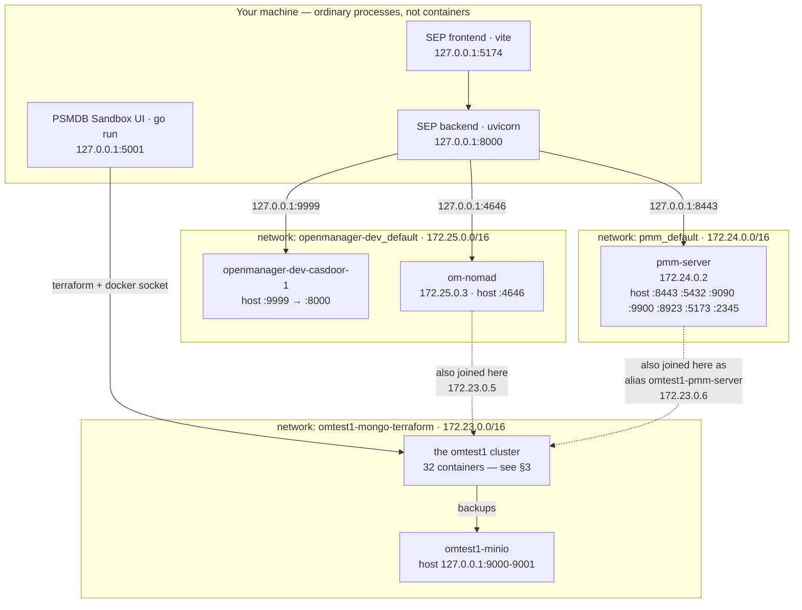
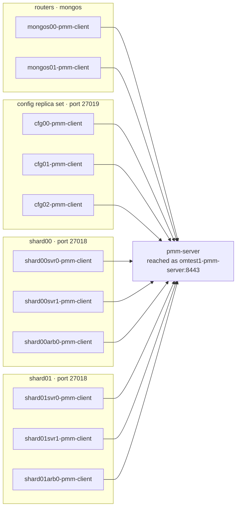
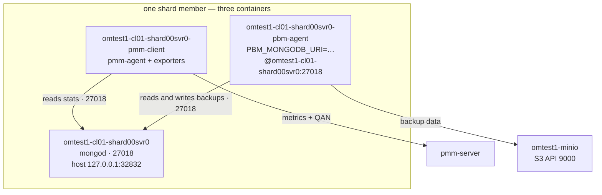
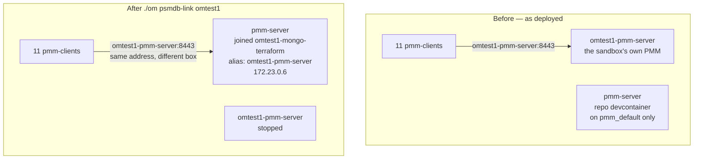

# The Container-Level Picture

Same system as [`topology.md`](topology.md), but concrete: real container names, real
Docker networks, real addresses, and exactly which container talks to which.

**As of:** 2026-08-03
**Derived from:** the live state of this workstation — `docker ps -a`,
`docker network ls`, `docker network inspect`, `docker inspect <container>`, `ss -ltnp`,
plus [`pmm/.env`](../pmm/.env) and [`../docker-compose.yml`](../docker-compose.yml).
One PSMDB sandbox environment named **`omtest1`** was deployed and linked when this was
captured.

> This is a **snapshot**, not a spec. Container names carry the sandbox environment name
> as a prefix, so with an environment called `foo` every `omtest1-…` below becomes
> `foo-…`. Re-derive it any time with the commands in [§8](#8-how-to-re-derive-this).

> **Scope, as of 2026-08-06.** This snapshot covers the **Terraform sandbox** layout, where
> `pmm-client` runs as a sidecar container per node and jobs execute in the shared
> `om-nomad` container. It predates the [`psmdb/`](../psmdb/) stack, whose nodes are one
> container each — mongod/mongos + pbm-agent + pmm-agent, joined to `pmm_default`, with a
> Nomad client per node and nothing published on the host. Everything below stays accurate
> for the sandbox; for the newer layout see [`topology.md`](topology.md) Part 3 and
> [`../psmdb/README.md`](../psmdb/README.md).

---

## 1. Three ideas you need first

If you already know Docker, skip to [§2](#2-the-whole-machine).

**A container is one process tree in a box.** It has its own filesystem and its own
network address. `omtest1-cl01-mongos00` is one container running one MongoDB router.

**A Docker network is a private LAN.** Containers on the same network reach each other
**by container name** — `omtest1-cl01-mongos00` resolves to an IP, automatically. There
is no DNS server to configure; Docker does it. Containers on *different* networks cannot
see each other at all, even on the same machine.

**A published port is a hole punched to the host.** `0.0.0.0:8443->8443` means "the
host's port 8443 forwards into this container". You need this for anything running
*outside* Docker to get in — which matters here, because **SEP is not in a container**.
It runs as an ordinary process on your machine, so it reaches everything through these
published ports on `127.0.0.1`, never by container name.

That last point explains most of the layout below.

---

## 2. The whole machine

Three Docker networks, one host process group, and one container that deliberately sits
on two networks at once.



The solid arrows from the host go through published ports. The **dotted** arrows are the
interesting part: `om-nomad` and `pmm-server` each have a second network interface on the
cluster's network. Without that, neither could resolve `omtest1-cl01-mongos00`, and
nothing would work. [§5](#5-the-link-trick) explains why.

| Network | Subnet | Who is on it | Created by |
| --- | --- | --- | --- |
| `omtest1-mongo-terraform` | 172.23.0.0/16 | the whole MongoDB cluster, MinIO, **plus** `pmm-server` and `om-nomad` as guests | the sandbox's Terraform |
| `pmm_default` | 172.24.0.0/16 | `pmm-server` only | `pmm/docker-compose.dev.yml` |
| `openmanager-dev_default` | 172.25.0.0/16 | `openmanager-dev-casdoor-1`, `om-nomad` | [`../docker-compose.yml`](../docker-compose.yml) |

---

## 3. Many PMM clients — the fan-out

This is what a real monitored estate looks like. The `omtest1` cluster is one sharded
MongoDB deployment: 2 routers, a 3-member config replica set, and two shards of 2 data
members + 1 arbiter each. **Every one of those 11 MongoDB containers gets its own
`pmm-client` container beside it**, and all 11 report to the single PMM server.



Every name above is really prefixed `omtest1-cl01-` — dropped here so the diagram stays
readable. All 11 have this in common, from `docker inspect`:

```
PMM_AGENT_SERVER_ADDRESS=omtest1-pmm-server:8443
PMM_AGENT_SERVER_USERNAME=admin
PMM_AGENT_SETUP=1
PMM_AGENT_SETUP_FORCE=1
PMM_AGENT_SETUP_NODE_TYPE=container
```

Two things to take from that:

- **The address is a container name, not an IP or a host port.** That is why the server
  has to be a member of this network — see [§5](#5-the-link-trick).
- **`PMM_AGENT_SETUP_FORCE=1` means a restart re-registers.** So after you re-point the
  agents, restarting these containers is all it takes; no config editing.

Each client differs only in what it was told to monitor, via its prerun script:

```
pmm-admin add mongodb --cluster=omtest1-cl01 --host=omtest1-cl01-mongos00 --port=27017 \
  --service-name=omtest1-cl01-mongos00-mongodb --enable-all-collectors …
```

So in PMM's inventory these arrive as 11 **services** on 11 **nodes**, all tagged with
cluster `omtest1-cl01` — and that grouping is what SEP later sees in its dropdowns.

---

## 4. Inside one monitored node

Zoom in on a single data-bearing member. The sandbox uses the **sidecar** pattern: one
job per container, sharing a network so they can reach each other by name.



Which sidecars exist where, and why:

| Sidecar | Where it runs | Count | Why not everywhere |
| --- | --- | --- | --- |
| `-pmm-client` | every mongos, config member, shard member **and arbiter** | 11 | everything is worth monitoring |
| `-pbm-agent` | config members + shard data members only | 7 | PBM needs a data-bearing member. Arbiters hold no data; mongos holds no data at all |
| `omtest1-cl01-pbm-cli` | one per cluster | 1 | the operator's entry point — `PBM_MONGODB_URI` points at `cfg00:27019`, since PBM is driven through the config replica set |

Host ports on the MongoDB containers (`127.0.0.1:32832`, `:32840`, …) are **randomised by
Docker**. Do not rely on them, and do not try to reach the cluster that way from a
script — this is exactly why the Nomad executor joins the network and uses names instead.

Also still running from the sandbox's own PMM deployment:
`omtest1-pmm-server-grafana-renderer` and `omtest1-pmm-server-watchtower`. Harmless
leftovers — their server is stopped.

---

## 5. The link trick

Here is the problem the whole workspace is built around.

The agents were told, at deploy time, to talk to **`omtest1-pmm-server:8443`**. That name
is baked into 11 containers by Terraform (`pmm_host = "${local.name_prefix}${…}"`), and
the sandbox UI exposes no field to change it. Meanwhile you want them reporting to the
**repo** PMM — the devcontainer built from your working tree — which is called
`pmm-server` and lives on a different network.

You cannot rename the repo container, and you cannot edit the agents. So instead you give
the repo container a **second name on the cluster's network**:



A *network alias* is just an extra DNS name for a container on one network. The live state
confirms it:

```
$ docker inspect pmm-server --format '…'
omtest1-mongo-terraform  aliases=[omtest1-pmm-server]  ip=172.23.0.6
pmm_default              aliases=[pmm-server]          ip=172.24.0.2
```

Zero configuration changed on either side — one DNS name now points somewhere else.

Three rules follow, and `om` enforces the first:

1. **The sandbox's own PMM must be stopped first.** Two containers behind one name would
   round-robin, and agents would land on either PMM at random. `psmdb-link` refuses while
   `omtest1-pmm-server` is running. Stopping it also frees host port 8443, which the repo
   PMM needs.
2. **Restart the clients after linking**, so `PMM_AGENT_SETUP_FORCE=1` re-registers them.
   `psmdb-link` does this.
3. **`om-nomad` needs the same treatment** — it is joined to the cluster network too
   (172.23.0.5), because its backup payloads connect to `omtest1-cl01-mongos00:27017` by
   name.

---

## 6. Every connection, with its address

| From | To | Address used | Protocol | Notes |
| --- | --- | --- | --- | --- |
| browser | SEP frontend | `localhost:5174` | HTTP | vite dev server |
| SEP frontend | SEP backend | `127.0.0.1:8000` | HTTP | vite proxy on `/api`, `/sep_app`, `/legacy`, `/stream-logs`, `/execution-events`, `/files` |
| SEP backend | Casdoor | `127.0.0.1:9999` | HTTP | published port; SEP is not on the Docker network |
| SEP backend | PMM | `127.0.0.1:8443` | HTTPS | `PMM.VERIFY_SSL: false` in dev; Bearer service account token |
| SEP backend | Nomad | `127.0.0.1:4646` | HTTP | register, dispatch, poll, stream logs |
| Nomad client | MongoDB | `omtest1-cl01-mongos00:27017` | MongoDB wire | **container name** — needs the network join |
| 11 × pmm-client | PMM server | `omtest1-pmm-server:8443` | gRPC over TLS, agent dials out | the alias from §5 |
| pmm-client | its mongod | `omtest1-cl01-<member>:27018/27019` | MongoDB wire | sidecar, same network |
| pbm-agent | its mongod | `omtest1-cl01-<member>:27018` | MongoDB wire | from `PBM_MONGODB_URI` |
| pbm-agent | MinIO | `omtest1-minio:9000` | S3 | backup storage |
| browser | PMM | `https://localhost:8443` | HTTPS | nginx inside the container fans out — see [topology.md §3](topology.md#part-3--inside-pmm-one-container-many-programs) |
| browser | Sandbox UI | `localhost:5001` | HTTP | |
| Sandbox UI | Docker | the Docker socket, via Terraform | — | it creates and destroys all the `omtest1-*` containers |

Note what is **absent**: nothing calls SEP. PMM does not know SEP exists. The whole
relationship is SEP pulling from PMM.

---

## 7. Host ports, as actually bound

Measured with `ss -ltnp`, cross-checked against [`pmm/.env`](../pmm/.env):

| Port | Bound on | Container / process | Note |
| --- | --- | --- | --- |
| 5174 | 127.0.0.1 | SEP frontend | |
| 8000 | 127.0.0.1 | SEP backend | |
| 5001 | 127.0.0.1 | Sandbox UI | |
| 9999 | 0.0.0.0 | `openmanager-dev-casdoor-1` | → container's 8000 |
| 4646 | 0.0.0.0 | `om-nomad` | |
| 8443 | 0.0.0.0 | `pmm-server` | HTTPS |
| 5432 | 0.0.0.0 | `pmm-server` | PostgreSQL |
| 9090 | 0.0.0.0 | `pmm-server` | VictoriaMetrics |
| **9900** | 0.0.0.0 | `pmm-server` | ClickHouse TCP — **moved off 9000** |
| **8923** | 0.0.0.0 | `pmm-server` | ClickHouse HTTP — moved off 8123 |
| 5173 | 0.0.0.0 | `pmm-server` | PMM's vite HMR |
| 2345 | 0.0.0.0 | `pmm-server` | delve debugger |
| 9000, 9001 | 127.0.0.1 | `omtest1-minio` | S3 API and console |
| 32830–32840 | 127.0.0.1 | the MongoDB containers | **randomised — do not depend on these** |

The two moved ports are the fix for a real collision: MinIO defaults to 9000, and so does
ClickHouse. `pmm/.env` here sets `PMM_PORT_CH_TCP=9900` and `PMM_PORT_CH_HTTP=8923`, which
resolves it. `./om ports` reports this class of clash.

Also in this `pmm/.env`: **`PMM_ENABLE_NOMAD=0`**, so PMM's own built-in Nomad server is
off and nginx is not proxying `/nomad/`. SEP uses the standalone `om-nomad` container
instead — see [topology.md §6](topology.md#part-6--how-a-job-actually-runs) for why that
container has to exist at all, and [nomad-in-pmm.md](nomad-in-pmm.md) for what the
topology would look like if that flag were `1` (including two blockers verified against
the very containers described above).

---

## 8. How to re-derive this

Nothing above is hand-maintained state; regenerate it whenever you doubt it.

```bash
# containers, images, ports
docker ps -a --format '{{.Names}}\t{{.Image}}\t{{.Status}}\t{{.Ports}}'

# which containers share a network
docker network ls
docker network inspect omtest1-mongo-terraform \
  --format '{{range .Containers}}{{.Name}} {{end}}' | tr ' ' '\n' | sort

# a container's networks, aliases and IPs — this is what proves the §5 alias
docker inspect pmm-server \
  --format '{{range $k,$v := .NetworkSettings.Networks}}{{$k}} {{$v.Aliases}} {{$v.IPAddress}}{{"\n"}}{{end}}'

# where an agent thinks its server is
docker inspect omtest1-cl01-mongos00-pmm-client \
  --format '{{range .Config.Env}}{{println .}}{{end}}' | grep PMM_AGENT_SERVER

# what is listening on the host
ss -ltnp

# and the workspace's own summary
./om status
./om ports
```
