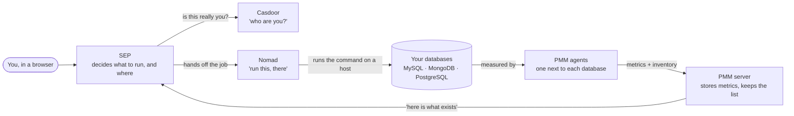
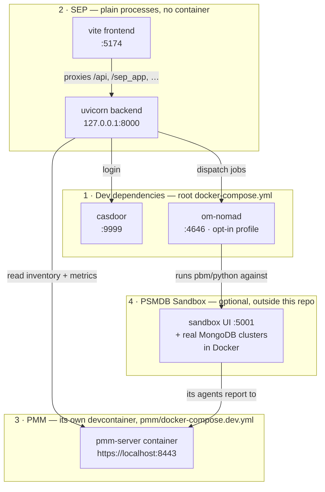
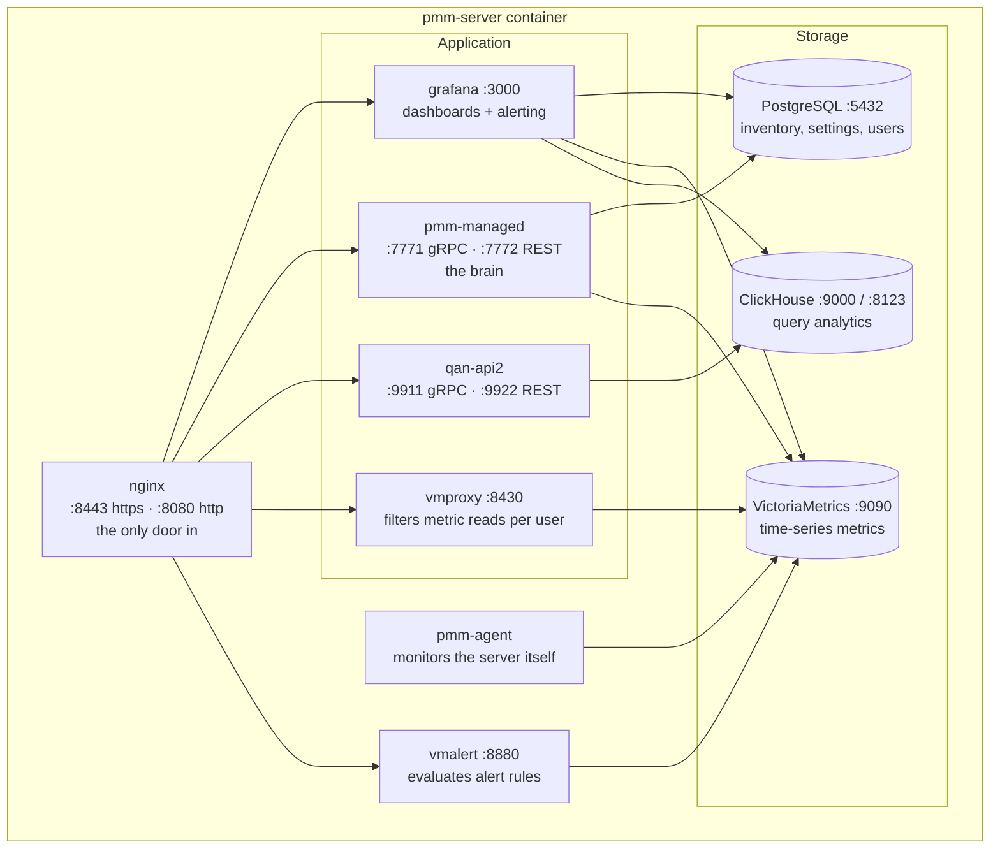
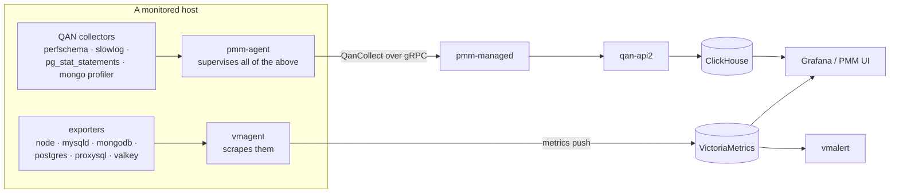
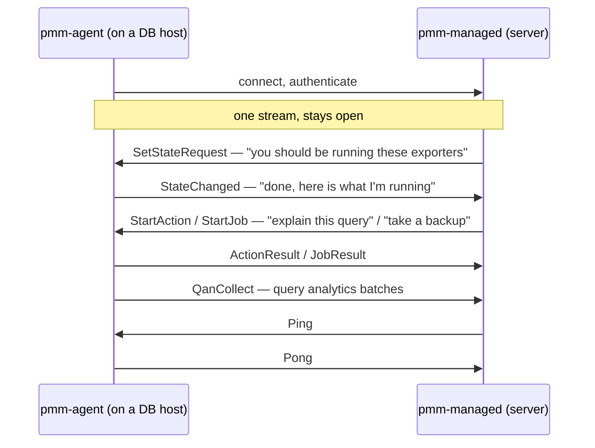
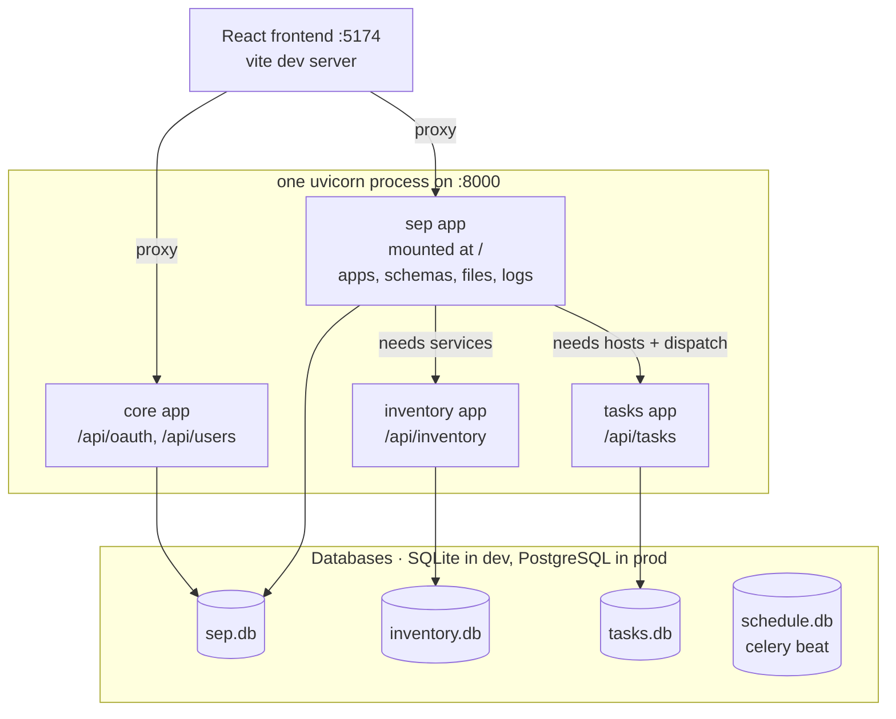
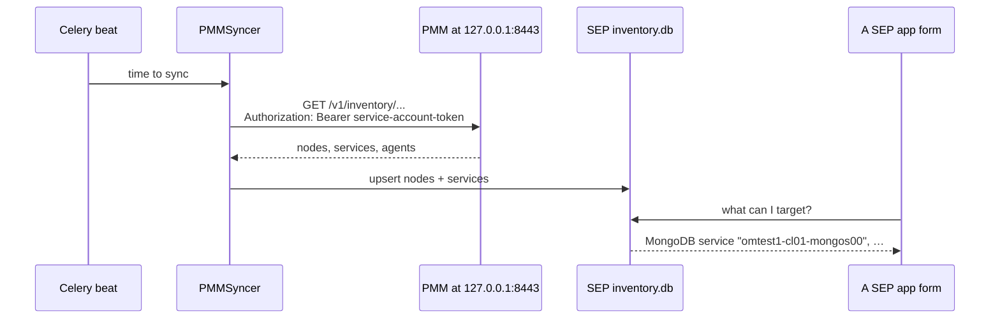
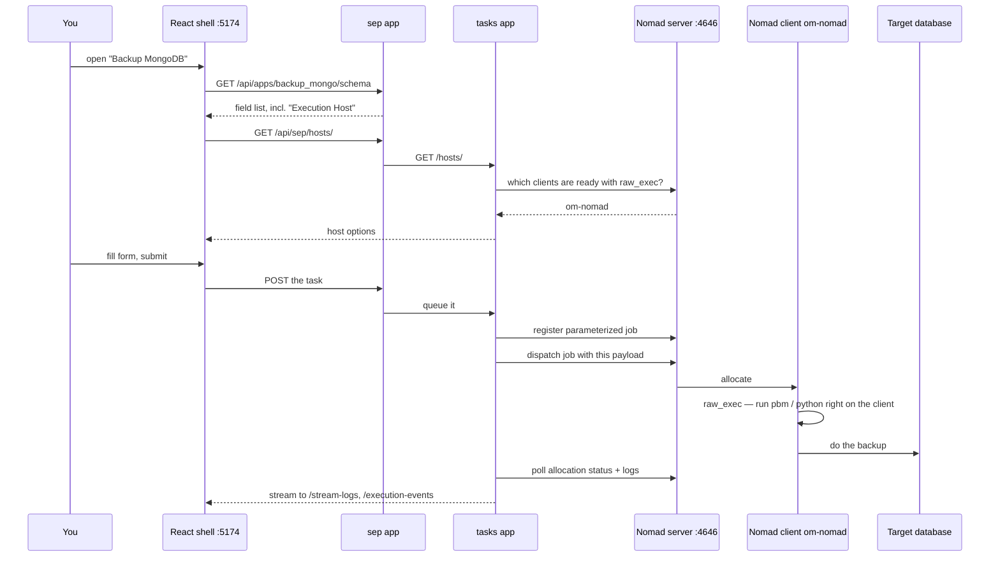
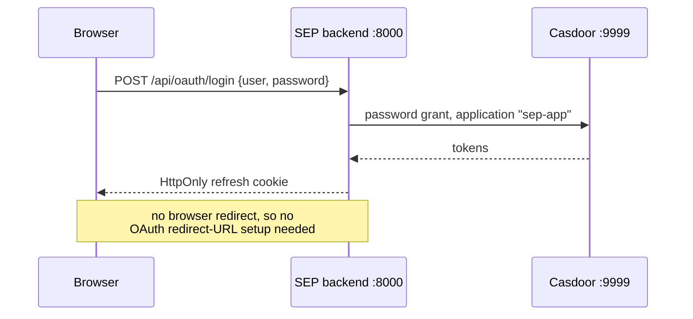
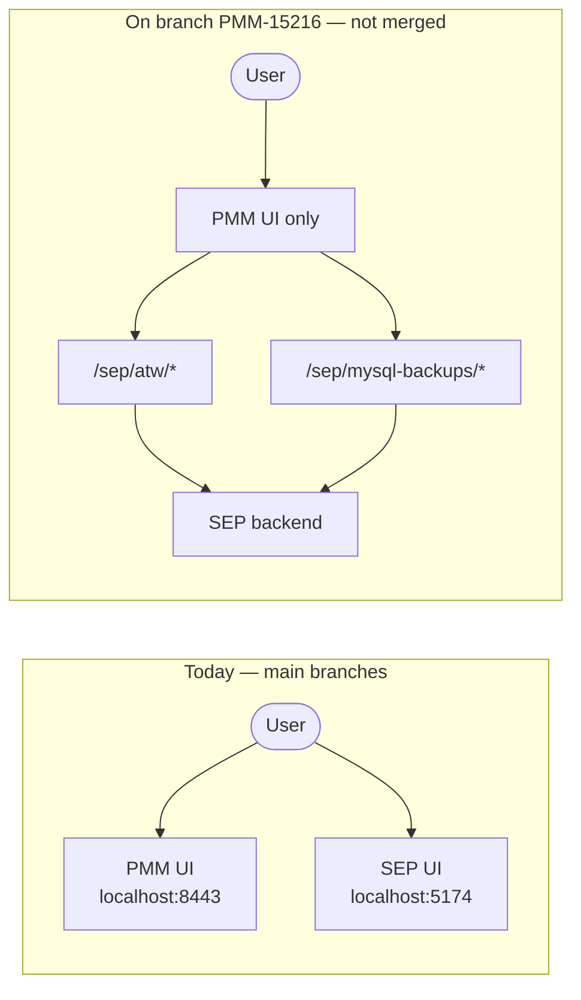

# How OpenManager Fits Together

**As of:** 2026-08-03
**Derived from:** `pmm/` @ `v3.8.1-154-g3fb35bd52` (`AGENTS.md`, `docker-compose.dev.yml`,
`build/ansible/roles/{supervisord,nginx}/files/*`, `managed/services/supervisord/*`),
`SEP/` @ `main` (`app/main.py`, `settings.yaml`, `app/tasks/execution/**`,
`app/sep/sync/syncers/pmm.py`, `frontend/packages/*`), plus the workspace's own
[`docker-compose.yml`](../docker-compose.yml), [`om`](../om) and [`nomad/`](../nomad/).

**How to read this:** Parts 1–2 are the plain-English version — read those first and you
will know what is running and why. Parts 3 onward add detail, one layer at a time. Every
name in *italics* the first time it appears is explained in
[`glossary.md`](glossary.md).

---

# Part 1 — The two products, in plain words

This workspace holds two separate Percona products that are being taught to work
together.

**PMM is the watcher.** You install a small program (an *agent*) next to each database.
The agent measures things — queries per second, slow queries, disk, memory — and ships
those numbers to a central PMM server. The server stores them and draws graphs. PMM also
keeps a list of everything it watches: which machines exist, which databases run on them.
PMM does not change your databases. It looks at them.

**SEP is the doer.** SEP takes actions: back up this MongoDB, collect diagnostics from
that server, run a checksum. It shows a web form per action, you fill it in, and SEP
arranges for the work to run on a chosen machine. But SEP does not go hunting for your
databases itself — it asks PMM. PMM already has the list.

Two supporting pieces exist only because SEP needs them:

- **Casdoor** — the login screen. SEP has no user accounts of its own, so it hands login
  off to Casdoor and trusts the answer.
- **Nomad** — the arm that actually runs a command on a machine. This matters: **SEP
  never connects to a database itself.** It decides *what* should run and *where*, then
  hands that to Nomad, which runs it on the chosen host.

So the whole loop, in one picture:



One sentence: **PMM knows what you have, SEP decides what to do about it, and Nomad is
what actually does it.**

Follow the arrows and you have the full cycle: your databases are measured by agents,
the agents feed PMM, PMM tells SEP what exists, SEP hands a job to Nomad, and Nomad acts
back on the databases. Part 6 walks that action path in detail.

---

# Part 2 — What actually runs on your machine

Locally this is **four independent stacks**. Nothing merges them; they just share the
same host and talk over `localhost` ports. `./om` is a script in this workspace that
starts and stops them together.



Why each one is shaped the way it is:

| Stack | Where it is defined | Why it is separate |
| --- | --- | --- |
| Dev dependencies | [`docker-compose.yml`](../docker-compose.yml) at the workspace root | Only the things SEP depends on. Casdoor always; Nomad behind an opt-in profile. |
| SEP | run natively via `make dev-backend` / `make dev-frontend` in `SEP/` | Runs straight from the working tree, so your edits are live with no image rebuild. |
| PMM | `pmm/docker-compose.dev.yml` | PMM ships its own devcontainer that mounts the repo, so `om build pmm` compiles *your* Go changes. A stock `percona/pmm-server:3` would run release binaries instead, and would fight over the `pmm-server` name and port 8443. |
| PSMDB Sandbox | `mongo_terraform_ansible/ui-go`, a git submodule | A separate tool that deploys real MongoDB clusters. It is the source of *real* databases for SEP to act on. |

The commands:

```bash
./om setup                     # one-time bootstrap, safe to re-run
./om start                     # deps + pmm + sep
./om start deps sep-backend    # or just some of it
./om status
./om ports                     # port collisions across all four stacks
./om stop
```

Full setup reasoning lives in [`../notes/sep-dev-quickstart.md`](../notes/sep-dev-quickstart.md).

> **Want the concrete version of this diagram?** [`containers.md`](containers.md) has the
> same picture with real container names, Docker networks and subnets, all 11
> `pmm-client` containers of a deployed cluster, and every connection with the exact
> address it uses.

---

# Part 3 — Inside PMM: one container, many programs

PMM Server looks like a single container, but inside it *supervisord* — a small process
babysitter — starts about a dozen programs. Half of them are written to disk at build
time; the rest are generated at runtime by `pmm-managed` itself, which is why the list
changes depending on your settings.



**nginx is the only door.** Everything above listens on `127.0.0.1` inside the
container; nothing but nginx is reachable from outside. That is why one port — 8443 —
gets you the whole product, and why the URL path decides which program answers:

| URL path | Goes to | What it is |
| --- | --- | --- |
| `/graph` | grafana `:3000` | dashboards, and PMM 3's alerting UI |
| `/pmm-ui`, `/` | static files | the React frontend from `pmm/ui` |
| `/v1/` | pmm-managed `:7772` | the main REST API — inventory, settings, backups |
| `/v1/qan` | qan-api2 `:9922` | query analytics API |
| `/prometheus/api/v1`, `/victoriametrics/` | vmproxy `:8430` | metric queries, filtered per user |
| `/prometheus/rules`, `/prometheus/alerts` | vmalert `:8880` | rule and alert state |
| `/nomad/` | nomad server `:4646` | only when `PMM_ENABLE_NOMAD` is set |
| `/auth_request` | pmm-managed | nginx asks "is this request allowed?" before serving anything |

Defined in `build/ansible/roles/nginx/files/conf.d/pmm.conf`.

**Started at build time** (`build/ansible/roles/supervisord/files/pmm.ini`, `grafana.ini`):
`pmm-init`, `postgresql`, `clickhouse`, `nginx`, `pmm-managed`, `pmm-agent`, `grafana`.

**Written at runtime by pmm-managed** (`managed/services/supervisord/supervisord.go`):
`victoriametrics`, `vmalert`, `vmproxy`, `qan-api2`, `nomad-server`. pmm-managed renders
these config files and tells supervisord to reload — that is how a settings change can
add or reconfigure a process without rebuilding the image.

> Note: there is **no Alertmanager** anywhere in this tree. PMM 2 had one; PMM 3 uses
> Grafana's built-in alerting instead. The root [`CLAUDE.md`](../CLAUDE.md) still lists
> it — see [Known drift](#known-drift).

## The two data pipelines

Metrics and query analytics travel completely different roads. Do not confuse them.



- **Metrics** — numbers over time. `vmagent` scrapes the exporters and pushes into
  VictoriaMetrics. Grafana reads it back.
- **Query analytics (QAN)** — individual query fingerprints and timings. Collected by
  pmm-agent, relayed through pmm-managed to qan-api2, stored in ClickHouse. ClickHouse is
  a *column store*, which is the right shape for "group millions of queries by
  fingerprint"; VictoriaMetrics would be the wrong tool, and vice versa.

## How agents connect

One long-lived, two-way *gRPC* stream per agent, and — this is the important part — the
**agent dials the server**, not the other way round. So agents work behind NAT and
firewalls, and PMM never needs a route back into your network.



PMM's own domain model is three nested things — worth learning, because SEP borrows it:

- **Node** — a machine.
- **Service** — a database running on a node.
- **Agent** — a process that watches a node or a service.

A node has many services; a service belongs to one node; an agent runs on a node and may
be attached to a service.

---

# Part 4 — Inside SEP: one process wearing four hats

SEP is a *FastAPI* application. In development it is **one** Python process that mounts
three sub-applications underneath the main one, so everything answers on port 8000. In
the production compose those same sub-apps can be split onto their own ports — same
code, different packaging.

From [`SEP/app/main.py`](../SEP/app/main.py):

```python
app.mount("/api/inventory", inventory_app)
app.mount("/api/tasks", tasks_app)
app.mount("/", sep_app)
```



The four hats:

| Sub-app | Path | Job |
| --- | --- | --- |
| core | `/api/oauth`, `/api/users` | login and accounts |
| inventory | `/api/inventory` | the list of nodes, services, schemas, tables — filled by syncers |
| tasks | `/api/tasks` | the job queue and the executors that run jobs |
| sep | `/` | the apps themselves: their forms, schemas, results, log streams |

Each publishes its own OpenAPI document (`/api/inventory/openapi.json`,
`/api/tasks/openapi.json`, `/api/sep/openapi.json`), and `/api/openapi.json` serves a
merged view. The top-level `/openapi.json` is core-only.

## SEP apps — the actual features

An "app" is one folder under [`SEP/app/sep/apps/`](../SEP/app/sep/apps/) exporting a
single `TaskExecutionApp` object. The framework reads that object's settings and
**derives** the whole HTTP surface from it — routes, schema, validation. Turning an app
on is one line under `SEP.APPS` in `settings.yaml`.

Currently enabled there: `inventory`, `snippets`, `atw`, `alters`, `archives`,
`mysql_backups`, `checksums`, `backup_mongo`, `backup_pg`, `dipper`, `topology`,
`alerts`, `alert_troubleshooting`, `report`.

The payoff of schema-derived apps: for the `task` and `script` flavors, **the frontend
needs no code**. The React shell fetches `/api/apps/<name>/schema` and renders the form
from it, so a brand-new app appears in the sidebar with no rebuild. Only the `base`
flavor (`custom_ui=True`) needs a real React component.

To write one, start with [`../notes/sep-apps-how-to-write-one.md`](../notes/sep-apps-how-to-write-one.md).
Scaffold with `make startapp` and never copy an existing app — the in-tree ones carry
deprecated wiring.

## Syncers — how the inventory gets filled

SEP's `inventory.db` starts empty. *Syncers* fill it on a schedule. Configured under
`SEP.SYNCERS` in `settings.yaml`: `PMMSyncer`, `MySQLSyncer`, `SystemFactsSyncer`.

`PMMSyncer` ([`SEP/app/sep/sync/syncers/pmm.py`](../SEP/app/sep/sync/syncers/pmm.py)) is
the cross-repo one, and the whole reason these two repos share a workspace.

## Celery — the background clock

*Celery* runs the scheduled work: syncers, periodic maintenance. Its schedule lives in
`schedule.db`. One trap worth knowing up front: on a fresh checkout the backend **will
not start** until Celery's beat scheduler has created its own tables once. `./om setup`
does that for you; the reasoning is in
[`../notes/sep-dev-quickstart.md`](../notes/sep-dev-quickstart.md) §3.3b.

---

# Part 5 — How SEP learns about your databases



Three things must be true for this to work:

1. **A token.** PMM 3 has no "API keys" page — that was PMM 2. Create a *service account
   token* under *Administration → Users and access → Service accounts*, then put it in
   `SEP/.env` as `PMM__API_KEY`. SEP sends it as `Authorization: Bearer <token>`, which
   is exactly how PMM 3 consumes that token.
2. **The syncer enabled** in `SEP/settings.yaml` under `SEP.SYNCERS`.
3. **TLS tolerance** — already handled: `FASTAPI_ENV` defaults to `development`, whose
   settings block sets `PMM.VERIFY_SSL: false`, so PMM's self-signed certificate is
   accepted.

Skip this and SEP still runs — forms render, but any dropdown that points at a real
database (`ServiceRef`, `SchemaRef`, `TableRef`) is empty and cannot be submitted.

---

# Part 6 — How a job actually runs

This is the part with the most moving pieces, so here it is end to end.



Four consequences that trip people up:

**Nomad is required for *any* task form, not just for running tasks.** Every task app
inherits an "Execution Host" field whose options come from `executor.get_hosts()`. With
no Nomad, the form shows *"Failed to get a response from Nomad"* and cannot be submitted
at all. `TaskBackendEnum` does contain a `CELERY` value, but nothing in the UI path
selects it — so Nomad is the only route today.

**The `raw_exec` driver runs commands directly on the Nomad client.** No container
wraps the payload. So the client image itself must carry whatever the payloads call —
which is why [`nomad/Dockerfile`](../nomad/Dockerfile) exists instead of using
`hashicorp/nomad`: it adds `python3` + `pip` (run-python payloads pip-install their
requirements at runtime) and `pbm` (the Mongo backup payloads shell out to the PBM CLI).
It is Oracle Linux 9 based because `pbm` links against krb5/gssapi and Percona publishes
el9 packages.

**PMM's own agent ships a Nomad client too**, and PMM 3 can run the server side
(`PMM_ENABLE_NOMAD`, nginx proxies `/nomad/`) — but the pmm-client image has neither
python3 nor pbm, so it cannot execute SEP's payloads. That road is worth understanding
even though it is closed: [`nomad-in-pmm.md`](nomad-in-pmm.md) works through what the
topology would look like, what PMM already builds for you, and exactly what blocks it.

**The executor needs to be on the right network.** PMM registers sandbox services by
*container* hostname (`omtest1-cl01-mongos00`) and their host ports are randomised, so
the Nomad container must join the cluster's Docker network to resolve those names.
`./om psmdb-link <env>` does that.

---

# Part 7 — Logging in

SEP has no user table of its own; Casdoor holds the accounts. The browser never touches
Casdoor directly in this flow — SEP does the exchange server-side.



Two setup facts that follow from this:

- Casdoor must be **seeded** from `SEP/data/casdoor_init_data.json`
  (`./generate_casdoor_init_data.sh`). The stock image's `app-built-in` application will
  not do — `settings.yaml` pins `application_name: sep-app`, and the generated app is
  what declares the `password` grant this flow uses.
- Casdoor must be published on **9999**, because that is what `settings.yaml`'s
  `allowed_issuers` expects.

The README's "add your Redirect URL" step applies to the older server-rendered UI on
`:8000`, not to this path.

---

# Part 8 — The part that is currently changing

Today SEP is a **separate website** from PMM. There is unmerged work to make SEP's
features appear as **pages inside PMM**, so a user sees one product.



Two independent tracks:

- **Track A — frontend port** (`origin/PMM-15216`): SEP's React packages moved into PMM's
  `ui/` workspace so SEP apps render as native PMM routes. ~320 files, ~95k insertions,
  no PR open. Only the `atw` app exists as a real ported package; `mysql_backups` rides a
  generic `SchemaDrivenPlugin`. Everything else is still SEP-only.
- **Track B — shared PostgreSQL** (`PMM-15238`): let a SEP container use PMM's embedded
  PostgreSQL, gated on `PMM_ENABLE_SEP`. Nothing new is published on the host.

Its current auth wiring is a **dev-only proxy shim** with no production path, and each
SEP frontend change has to be hand-ported onto the branch. **Read
[`../notes/sep-pmm-integration.md`](../notes/sep-pmm-integration.md) before touching
either side of this boundary** — it has the branch state, the quirks, and the open
questions.

---

# Part 9 — Reference

## Host ports

| Port | Owner | Notes |
| --- | --- | --- |
| 8000 | SEP backend (uvicorn) | `127.0.0.1` only |
| 5174 | SEP frontend (vite) | proxies to 8000 |
| 9999 | Casdoor | must be 9999 — `allowed_issuers` |
| 4646 | Nomad (`om-nomad`) | opt-in profile |
| 8443 | PMM HTTPS | `pmm/.env` `PMM_PORT_HTTPS`, forced to 8443 because SEP pins it |
| 5432 | PMM PostgreSQL | published by `pmm/docker-compose.dev.yml` |
| 9090 | PMM VictoriaMetrics | |
| 9000 | PMM ClickHouse TCP | **collides with sandbox MinIO** — set `PMM_PORT_CH_TCP=9900` |
| 8123 | PMM ClickHouse HTTP | |
| 5173 | PMM vite HMR | distinct from SEP's 5174 |
| 5001 | PSMDB Sandbox UI | |

`./om ports` prints this plus what is actually listening.

## Inside the PMM container

| Program | Port | Started by |
| --- | --- | --- |
| nginx | 8443 / 8080 | build-time `pmm.ini` |
| pmm-managed | 7771 gRPC, 7772 REST | build-time `pmm.ini` |
| postgresql | 5432 | build-time `pmm.ini` |
| clickhouse | 9000, 8123 | build-time `pmm.ini` |
| pmm-agent | — | build-time `pmm.ini` |
| grafana | 3000 | build-time `grafana.ini` |
| victoriametrics | 9090 | pmm-managed at runtime |
| vmalert | 8880 | pmm-managed at runtime |
| vmproxy | 8430 | pmm-managed at runtime |
| qan-api2 | 9911 gRPC, 9922 REST | pmm-managed at runtime |
| nomad-server | 4646 | pmm-managed at runtime, when enabled |

## Who talks to whom

| From | To | How |
| --- | --- | --- |
| pmm-agent | pmm-managed | outbound gRPC stream, agent dials server |
| vmagent | VictoriaMetrics | metrics push |
| SEP `PMMSyncer` | PMM `/v1/inventory` | REST + Bearer service account token |
| SEP backend | Casdoor | OAuth2 password grant, server-side |
| SEP tasks app | Nomad `:4646` | REST — register, dispatch, poll, stream logs |
| Nomad client | target database | `raw_exec`, commands run directly on the client |
| SEP frontend | SEP backend | vite proxy on `/api`, `/sep_app`, `/legacy`, `/stream-logs`, `/execution-events`, `/files` |

## The files that define all this

| File | Defines |
| --- | --- |
| [`../docker-compose.yml`](../docker-compose.yml) | Casdoor + Nomad, with the reasoning in comments |
| [`../om`](../om) | how all four stacks start, stop, and link |
| [`../nomad/Dockerfile`](../nomad/Dockerfile), [`../nomad/nomad.hcl`](../nomad/nomad.hcl) | the executor image and its client config |
| `SEP/app/main.py` | the four-hats mount layout |
| `SEP/settings.yaml` | which apps and syncers are on, and every endpoint |
| `SEP/app/sep/sync/syncers/pmm.py` | the SEP→PMM inventory pull |
| `SEP/app/tasks/execution/executors/nomad/models.py` | job register, dispatch, log streaming |
| `pmm/docker-compose.dev.yml` | the PMM devcontainer |
| `pmm/build/ansible/roles/nginx/files/conf.d/pmm.conf` | PMM's URL routing |
| `pmm/build/ansible/roles/supervisord/files/pmm.ini` | PMM's build-time processes |
| `pmm/managed/services/supervisord/supervisord.go` | PMM's runtime-generated processes |

## Known drift

Recorded rather than silently fixed, because each needs its own change:

1. The root [`CLAUDE.md`](../CLAUDE.md) lists **Alertmanager** in PMM's backend stack.
   There is no Alertmanager anywhere in `pmm/` — PMM 3 uses Grafana alerting. PMM 2 had
   one.
2. The root [`CLAUDE.md`](../CLAUDE.md) points `PMMSyncer` at
   `SEP/app/sep/sync/syncers/pmm.py` — correct — but an older path
   (`SEP/app/inventory/syncers/pmm.py`) still circulates in other docs. Also tracked in
   [`../notes/sep-pmm-integration.md`](../notes/sep-pmm-integration.md) §7.
3. SEP's own `README.md` carries several stale sections — PMM 2 instructions, a
   superseded `PLUGINS:` block, a setting that exists nowhere in the code. The full list
   is in [`../notes/sep-dev-quickstart.md`](../notes/sep-dev-quickstart.md) §6.

---

## Where to go next

- Want the *container-level* wiring — real names, networks, many PMM clients? [`containers.md`](containers.md)
- Wondering why SEP does not just use *PMM's own Nomad*? [`nomad-in-pmm.md`](nomad-in-pmm.md)
- Want to *run* this? [`../notes/sep-dev-quickstart.md`](../notes/sep-dev-quickstart.md)
- Want to *write a SEP app*? [`../notes/sep-apps-how-to-write-one.md`](../notes/sep-apps-how-to-write-one.md)
- Want to work on the *merge*? [`../notes/sep-pmm-integration.md`](../notes/sep-pmm-integration.md)
- Hit an unfamiliar word? [`glossary.md`](glossary.md)
